# Shoes Planet (i.e. The Shoe Store)

This project, i.e. "Build a Shoe Store Inventory App" was the 1st project
for [Android Kotlin Developer Nanodegree by Udacity](https://www.udacity.com/course/android-kotlin-developer-nanodegree--nd940)
. The goal of this project was to build an app that challenged me to implement the layouts and the
navigation features.

I went beyond the project's initial requirements and extended the scope of project by implementing
advance features, such as Room Database, Recyclerview, ViewPager2 for Slideshow and integrated a 3rd
party library to show circular progress bar with animation.

This project consists of mainly a single MainActivity and seven Fragments:

1. Splash Screen
2. SignIn screen
3. SignUp screen
4. Instructions screen
5. Listing Screen
6. Add/Edit Screen
7. Details screen

## Built With
* [ViewBinding](https://developer.android.com/topic/libraries/view-binding) - View binding is a
  feature that allows you to more easily write code that interacts with views.
* [DataBinding](https://developer.android.com/topic/libraries/data-binding) - The Data Binding
  Library is a support library that allows you to bind UI components in your layouts to data sources
  in your app using a declarative format rather than programmatically.
* [LiveData](https://developer.android.com/topic/libraries/architecture/livedata) - LiveData is an
  observable data holder class. Unlike a regular observable, LiveData is lifecycle-aware, meaning it
  respects the lifecycle of other app components, such as activities, fragments, or services.
* [Room](https://developer.android.com/jetpack/androidx/releases/room) - The Room persistence
  library provides an abstraction layer over SQLite to allow for more robust database access while
  harnessing the full power of SQLite.
* [Coroutines](https://developer.android.com/kotlin/coroutines) - A coroutine is a concurrency
  design pattern that you can use on Android to simplify code that executes asynchronously.
* [Jetpack Navigation](https://developer.android.com/guide/navigation) - It helps in implementing
  navigation, from simple button clicks to more complex patterns
* [ViewPager2](#) - Display Views or Fragments in a swipeable format.
* [Dot Indicator](https://github.com/tommybuonomo/dotsindicator) - This library makes it possible to
  represent View Pager Dots Indicator with 3 different awesome styles.
* [circularprogressbar](https://github.com/lopspower/CircularProgressBar) - This is an Android
  project allowing to realize a circular ProgressBar in the simplest way possible.

## Screenshots

### Splash Screen (with circularprogressbar)

### SignIn

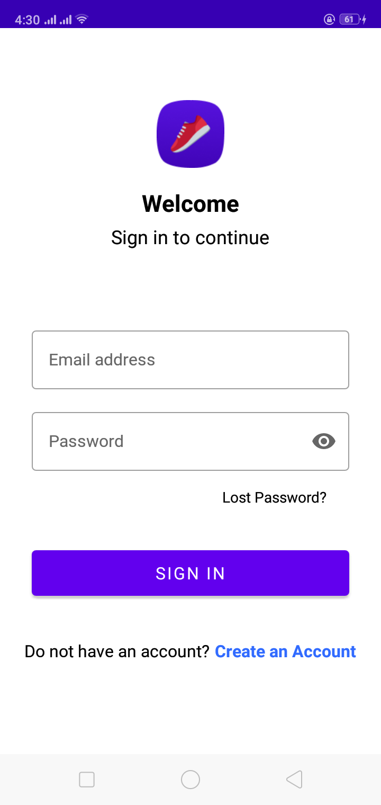

### Create an Account

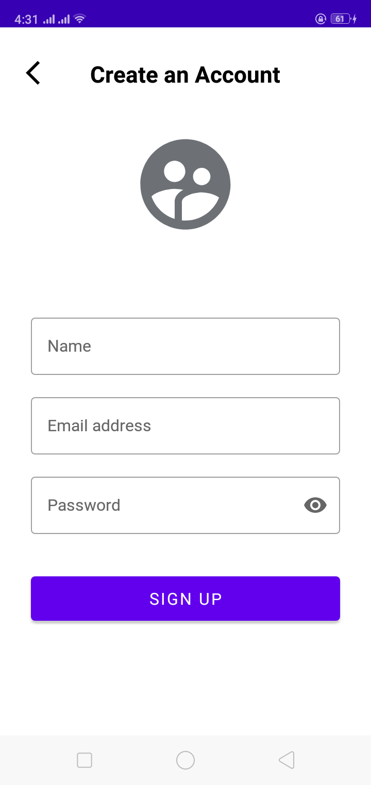

### Instruction #1 (ViewPager2 + Dot Indicator)

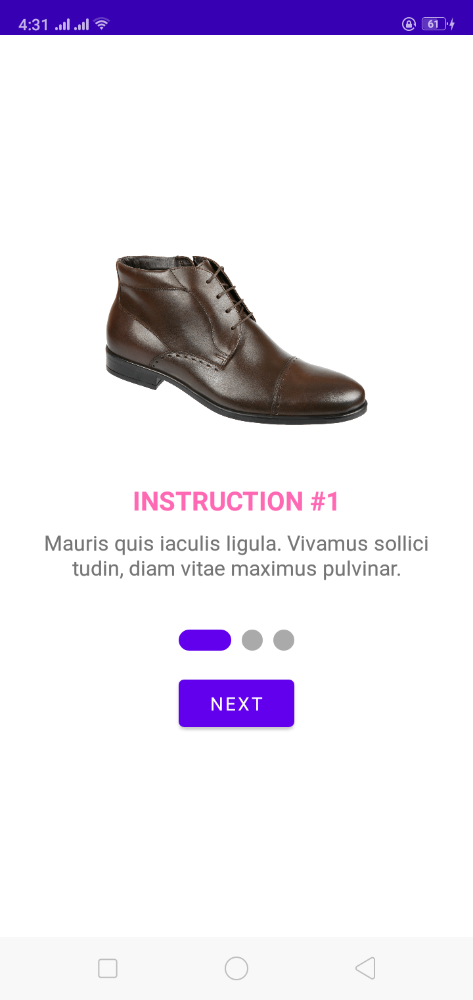

### Instruction #2 (ViewPager2 + Dot Indicator)

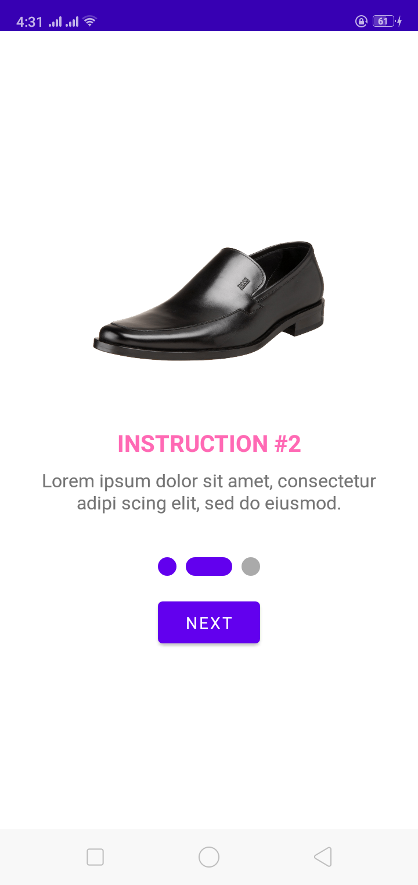

### Instruction #3 (ViewPager2 + Dot Indicator)

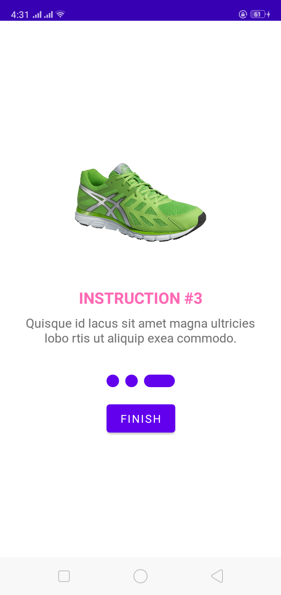

### List of Shoes (When no record exists)

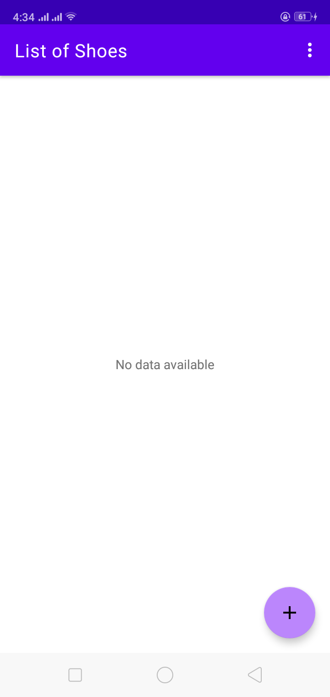

### List of Shoes (with entries)

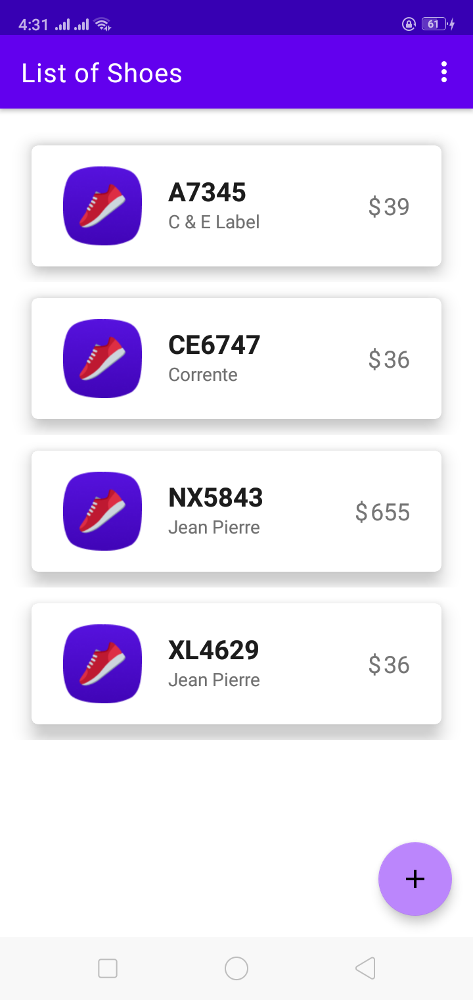

### Shoe Details

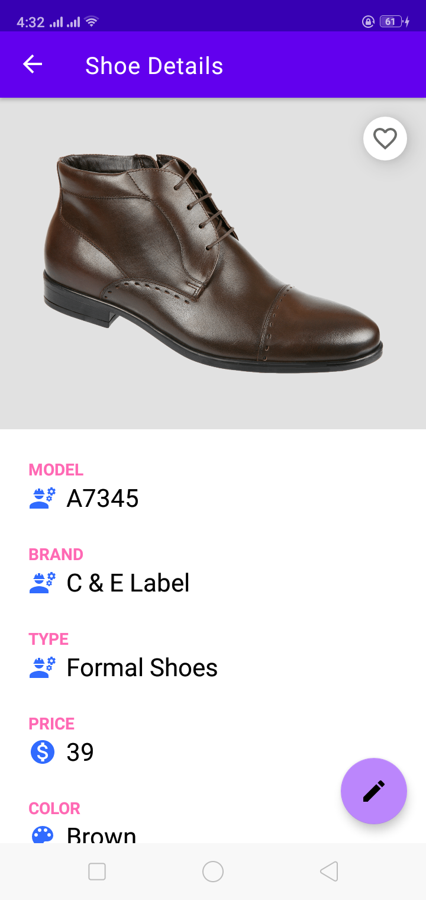

### Add New Shoe

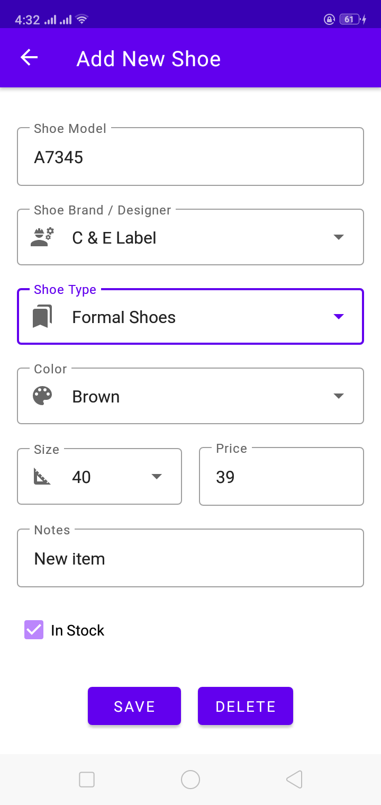

### Add New Shoe (With dropdown menus)

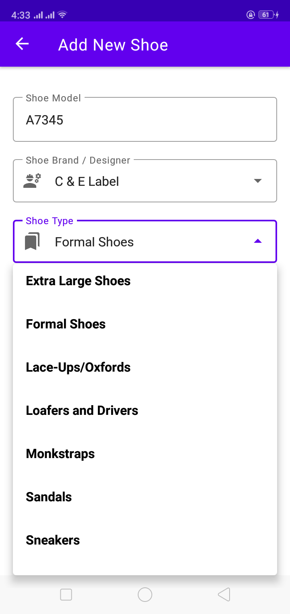

### Edit Shoe

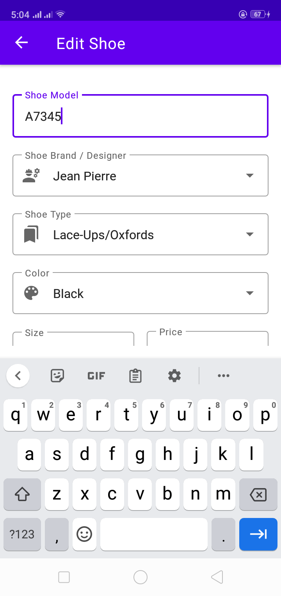
